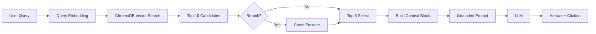

# Architecture — RAG Pipeline (Day 08 Lab)

> Template: Điền vào các mục này khi hoàn thành từng sprint.
> Deliverable của Documentation Owner.

## 1. Tổng quan kiến trúc

```
[Raw Docs]
    ↓
[index.py: Preprocess → Chunk → Embed → Store]
    ↓
[ChromaDB Vector Store]
    ↓
[rag_answer.py: Query → Retrieve → Rerank → Generate]
    ↓
[Grounded Answer + Citation]
```

**Mô tả ngắn gọn:**
> Nhóm xây dựng trợ lý AI nội bộ cho khối CS và IT Helpdesk. Hệ thống RAG này giúp tìm kiếm nhanh chóng và đối đáp chính xác các thông tin phức tạp như: chính sách bảo hành, SLA xử lý ticket, SOP cấp quyền IT và chính sách nhân sự. Mắt xích RAG giúp hệ thống chặn đứng rủi ro hallucinate, mang lại câu trả lời minh bạch theo đúng quy định công ty.

---

## 2. Indexing Pipeline (Sprint 1)

### Tài liệu được index
| File | Nguồn | Department | Số chunk |
|------|-------|-----------|---------|
| `policy_refund_v4.txt` | policy/refund-v4.pdf | CS | 6 |
| `sla_p1_2026.txt` | support/sla-p1-2026.pdf | IT | 5 |
| `access_control_sop.txt` | it/access-control-sop.md | IT Security | 7 |
| `it_helpdesk_faq.txt` | support/helpdesk-faq.md | IT | 6 |
| `hr_leave_policy.txt` | hr/leave-policy-2026.pdf | HR | 5 |

### Quyết định chunking
| Tham số | Giá trị | Lý do |
|---------|---------|-------|
| Chunk size | 400 tokens (~1600 ký tự) | Giữ được trọn vẹn ngữ cảnh của 1-2 đoạn văn và điều khoản mà không làm loãng thông tin. |
| Overlap | 80 tokens | Ngăn rủi ro cắt cụt giữa một câu hoặc điều khoản liên kết. |
| Chunking strategy | Heading-based + paragraph-based | Tôn trọng cấu trúc vạch sẵn `=== Section ===` giúp Vector Embeddings bắt ý tốt hơn. |
| Metadata fields | source, section, effective_date, department, access | Phục vụ filter, trích xuất citation |

### Embedding model
- **Model**: `AITeamVN/Vietnamese_Embedding` chạy local (HuggingFace)
- **Vector store**: ChromaDB (PersistentClient)
- **Similarity metric**: Cosine

---

## 3. Retrieval Pipeline (Sprint 2 + 3)

### Baseline (Sprint 2)
| Tham số | Giá trị |
|---------|---------|
| Strategy | Dense (embedding similarity) |
| Top-k search | 10 |
| Top-k select | 3 |
| Rerank | Không |

### Variant (Sprint 3)
| Tham số | Giá trị | Thay đổi so với baseline |
|---------|---------|------------------------|
| Strategy | Hybrid (Dense + Sparse BM25) với Reciprocal Rank Fusion (RRF) | Chuyển từ Dense thuần túy sang kết hợp trộn BM25 Keyword Search |
| Top-k search | 10 | Giữ nguyên độ phủ |
| Top-k select | 3 | Lấy 3 chunk xuất sắc nhất để tiết kiệm Token LLM |
| Rerank | Không sử dụng | Giữ nguyên (Tuân thủ luật đổi đúng 1 biến) |
| Query transform | Không sử dụng | Giữ nguyên |

**Lý do chọn variant này:**
> Nhóm chọn chiến lược **Hybrid Retrieval thuần túy không Rerank**. Kho tài liệu nội bộ chứa cả ngôn ngữ tự nhiên dài dòng lẫn các mã lỗi/viết tắt bắt buộc phải tuyệt đối chính xác từng ký tự khi tra cứu (như `ERR-403-AUTH`, `SLA P1`). 
> Dense Semantic Search quá lỏng lẻo với mã lỗi, trong khi Sparse BM25 quá cứng nhắc với từ khóa đồng nghĩa. Gộp cả 2 bằng RRF mang lại Recall bao phủ rộng nhất.

---

## 4. Generation (Sprint 2)

### Grounded Prompt Template
```text
Bạn là trợ lý nội bộ cho khối CS + IT Helpdesk. Hãy trả lời câu hỏi CHỈ DỰA TRÊN context được cung cấp bên dưới.

Quy tắc BẮT BUỘC:
1. CHỈ sử dụng thông tin có trong Context. TUYỆT ĐỐI KHÔNG bịa thêm con số, tên, quy trình.
2. Nếu context KHÔNG ĐỦ thông tin để trả lời, hãy nói rõ: "Không tìm thấy thông tin này trong tài liệu hiện hành, vui lòng liên hệ IT Helpdesk."
3. Trích dẫn nguồn bằng số trong ngoặc vuông [1], [2], ... tương ứng với context.

Question: {query}

Context:
[1] {source} | {section} | score={score}
{chunk_text}
```

### LLM Configuration
| Tham số | Giá trị |
|---------|---------|
| Model | `gpt-4o-mini` (OpenAI) |
| Temperature | 0 (Nhấn mạnh tính Factual/ Grounded ổn định) |
| Max tokens | 512 |

---

## 5. Failure Mode Checklist

> Dùng khi debug — kiểm tra lần lượt: index → retrieval → generation

| Failure Mode | Triệu chứng | Cách kiểm tra |
|-------------|-------------|---------------|
| Index lỗi | Retrieve về docs cũ / sai version | `inspect_metadata_coverage()` trong index.py |
| Chunking tệ | Chunk cắt giữa điều khoản | `list_chunks()` và đọc text preview |
| Retrieval lỗi | Không tìm được expected source | `score_context_recall()` trong eval.py |
| Generation lỗi | Answer không grounded / bịa | `score_faithfulness()` trong eval.py |
| Token overload | Context quá dài → lost in the middle | Kiểm tra độ dài context_block |

---

## 6. Diagram (tùy chọn)


