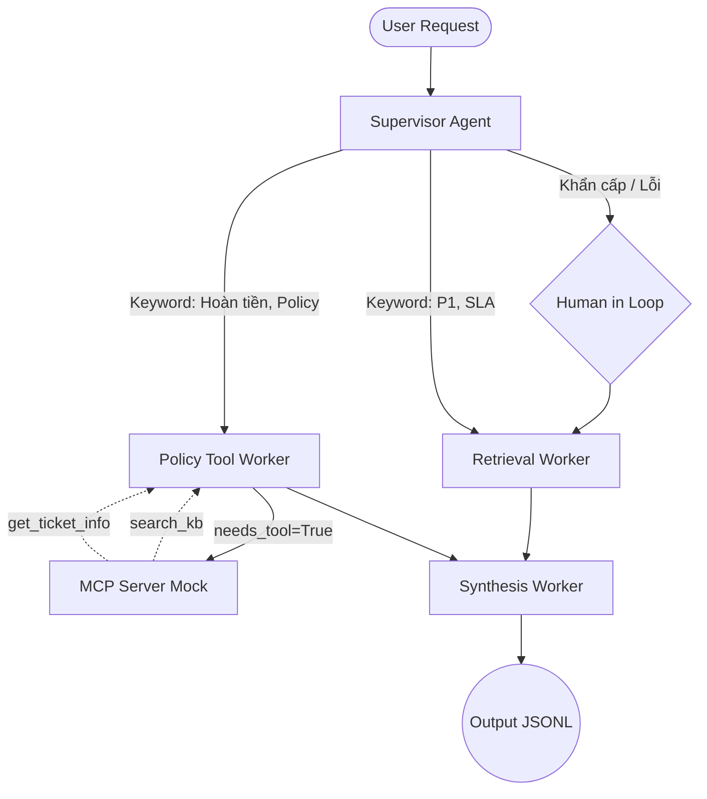

# System Architecture — Lab Day 09

**Nhóm:** C401-C1  
**Ngày:** 14-04-2026
**Version:** 1.0

---

## 1. Tổng quan kiến trúc

> Mô tả ngắn hệ thống của nhóm: chọn pattern gì, gồm những thành phần nào.

**Pattern đã chọn:** Supervisor-Worker  
**Lý do chọn pattern này (thay vì single agent):**
Kiến trúc này tách bạch trách nhiệm rõ rệt. Supervisor có vai trò duy nhất là phân tích context (Risk & Keywords) để định tuyến. Các Worker đóng vai trò là domain expert với logic chuyên biệt cho việc lấy Data, Check Policy, hay Tổng hợp. Nhờ vậy, pipeline minh bạch, dễ trace routing, khi lỗi cũng không lan sang node khác. Khả năng mở rộng được giải quyết triệt để (như việc gắn MCP vào Policy).

---

## 2. Sơ đồ Pipeline

**Sơ đồ thực tế của nhóm:**

---

## 3. Vai trò từng thành phần

### Supervisor (`graph.py`)

| Thuộc tính | Mô tả |
|-----------|-------|
| **Nhiệm vụ** | Phân loại câu hỏi của người dùng và điều hướng sang đúng Worker xử lý dựa trên keywords hoặc LLM routing. |
| **Input** | `state.task` |
| **Output** | supervisor_route, route_reason, risk_high, needs_tool |
| **Routing logic** | Heuristic fallback regexes (Hoàn tiền, Access) hoặc LLM Zero-shot. |
| **HITL condition** | Khai báo `risk_high` (2AM, khẩn cấp) + Tồn tại "ERR-", auto pause human review. |

### Retrieval Worker (`workers/retrieval.py`)

| Thuộc tính | Mô tả |
|-----------|-------|
| **Nhiệm vụ** | Truy vấn DB Vector (Chroma) để lấy chính xác top_k chunks. |
| **Embedding model** | OpenAI text-embedding-3-small (with all-MiniLM-L6-v2 fallback) |
| **Top-k** | 3 chunks. |
| **Stateless?** | Yes |

### Policy Tool Worker (`workers/policy_tool.py`)

| Thuộc tính | Mô tả |
|-----------|-------|
| **Nhiệm vụ** | Phân tích ngoại lệ chính sách (Sử dụng rule-base bắt buộc) và Fetch mock server data (MCP). |
| **MCP tools gọi** | `search_kb`, `get_ticket_info`. |
| **Exception cases xử lý** | Flash Sale, Digital Product / Subscriptions, Activated Product. |

### Synthesis Worker (`workers/synthesis.py`)

| Thuộc tính | Mô tả |
|-----------|-------|
| **LLM model** | OpenAI / Gemini Fallbacks. |
| **Temperature** | 0.1 |
| **Grounding strategy** | Explicit prompt "CHỈ trả lời dựa vào context cung cấp". |
| **Abstain condition** | Tự động trả về Abstain Statement kèm theo Constraint Confidence = 0.1 nếu Chunk Length = 0. |

### MCP Server (`mcp_server.py`)

| Tool | Input | Output |
|------|-------|--------|
| search_kb | query, top_k | chunks, sources |
| get_ticket_info | ticket_id | ticket details |
| check_access_permission | access_level, requester_role | can_grant, approvers |
| create_ticket | priority, title, description | ticket_id, status |

---

## 4. Shared State Schema

| Field | Type | Mô tả | Ai đọc/ghi |
|-------|------|-------|-----------|
| task | str | Câu hỏi đầu vào | supervisor đọc |
| supervisor_route | str | Worker được chọn | supervisor ghi |
| route_reason | str | Lý do route | supervisor ghi |
| retrieved_chunks | list | Evidence từ retrieval | retrieval ghi, synthesis đọc |
| policy_result | dict | Kết quả kiểm tra policy | policy_tool ghi, synthesis đọc |
| mcp_tools_used | list | Tool calls đã thực hiện | policy_tool ghi |
| final_answer | str | Câu trả lời cuối | synthesis ghi |
| confidence | float | Mức tin cậy (Calculate penalty) | synthesis ghi |

---

## 5. Lý do chọn Supervisor-Worker so với Single Agent (Day 08)

| Tiêu chí | Single Agent (Day 08) | Supervisor-Worker (Day 09) |
|----------|----------------------|--------------------------|
| Debug khi sai | Khó — không rõ lỗi ở đâu | Dễ hơn — test từng worker độc lập |
| Thêm capability mới | Phải sửa toàn bộ prompt | Chỉ việc gắn thẻ Worker/MCP tool riêng biệt |
| Routing visibility | Mù mờ logic Prompting LLM | State Node có route_reason trong từng log trace (JSONL) |

**Nhóm điền thêm quan sát từ thực tế lab:**
Việc chia tách Node giúp chúng tôi dễ dàng thực thi Abstain Logic tuyệt đối cho Synthesis Worker, trong khi xử lý logic Flash Sale bằng Rule-based ở Policy Worker 1 cách nhẹ nhàng mà không tạo xung đột System Prompts như RAG Mono Day 08.

---

## 6. Giới hạn và điểm cần cải tiến

1. Cần tích hợp full HTTP Web Server với MCP Lib framework thật để mở rộng gọi Tool qua RESTful thay vì Module Mock Dispatch nội bộ.
2. Cụm Supervisor LLM khi dính Rate Limit có xu hướng phải Fallback về Rule, có thể gắn Model Router nhẹ gọn như T5 trên local thay vì RegEx Heuristic.
3. Độ tin cậy `confidence` chỉ được tính toán bằng heuristic calculation (Chunk distance) thay vì LLM as a Judge.
