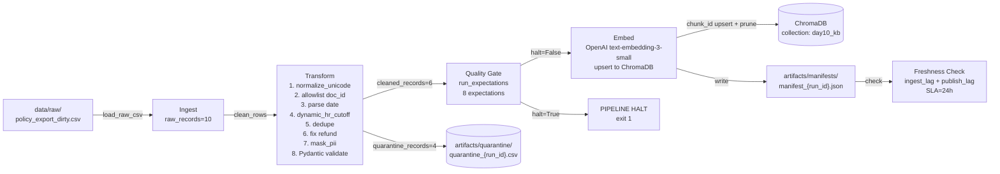

# Kiến trúc pipeline — Lab Day 10

**Nhóm:** C401 — C1  
**Cập nhật:** 2026-04-15 | `run_id: clean-run`

---

## 1. Sơ đồ luồng

**Điểm đo freshness (2 boundary):**
- `ingest_lag` = `latest_exported_at` → `run_timestamp` (data staleness)
- `publish_lag` = `run_timestamp` → `now` (index staleness)

**run_id** ghi trong: `artifacts/logs/run_{run_id}.log` + manifest JSON.  
**Quarantine:** `artifacts/quarantine/quarantine_{run_id}.csv`

---

## 2. Ranh giới trách nhiệm

| Thành phần | Input | Output | File |
|------------|-------|--------|------|
| Ingest | `data/raw/policy_export_dirty.csv` | `List[Dict]` raw rows | `etl_pipeline.py` |
| Transform | raw rows | cleaned rows + quarantine rows | `transform/cleaning_rules.py` |
| Quality | cleaned rows | `List[ExpectationResult]`, `should_halt` | `quality/expectations.py` |
| Embed | `artifacts/cleaned/*.csv` | ChromaDB upsert + prune, manifest JSON | `etl_pipeline.py` |
| Monitor | `artifacts/manifests/*.json` | PASS/WARN/FAIL, `ingest_lag`, `publish_lag` | `monitoring/freshness_check.py` |

---

## 3. Idempotency & rerun

Embed dùng **upsert theo `chunk_id`** (stable hash: `sha256(doc_id|chunk_text|seq)[:16]`).

- Rerun 2 lần cùng data → **không duplicate vector** — Chroma upsert ghi đè cùng ID
- **Prune:** pipeline xoá ID trong collection không còn trong cleaned CSV hiện tại
- Kết quả: `embed_upsert count=6` bất kể chạy lần 1 hay lần 10 trên cùng data

---

## 4. Liên hệ Day 09

Pipeline Day 10 cung cấp corpus cho retrieval Day 09:

- **Cùng tập docs:** `data/docs/` (policy_refund_v4, sla_p1_2026, it_helpdesk_faq, hr_leave_policy)
- **Khác collection:** Day 10 dùng `day10_kb` — tách để tránh ảnh hưởng nhau khi inject corrupt
- **Phục vụ:** Day 09 multi-agent truy vấn `day10_kb` qua ChromaDB persistent client

---

## 5. Rủi ro đã biết

- `freshness_check=FAIL` luôn xảy ra với data mẫu (`exported_at=2026-04-10`, SLA=24h) — expected, xem `runbook.md`
- `ingest_lag_hours≈116` vượt SLA do data mẫu cũ theo thiết kế lab
- PII regex (`_PHONE_VN_RE`) có thể false-positive trên số dạng khác — E8 dùng `warn` không `halt`
